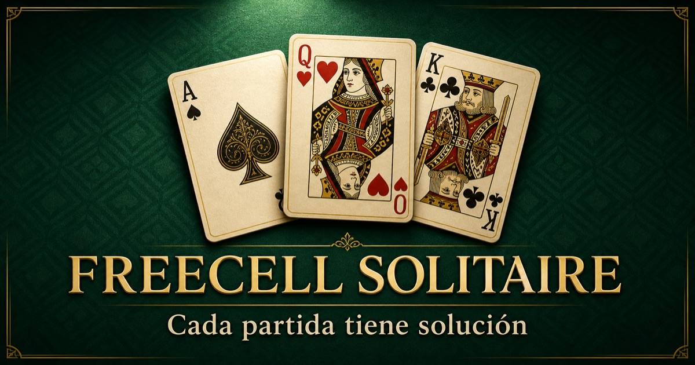

# Solitario FreeCell gratis online

Juega gratis a **Solitario FreeCell (Carta Blanca)** desde el móvil, la tableta o el ordenador. No requiere registro ni instalación.

## Jugar ahora

➡️ **[Abrir Solitario FreeCell gratis](https://freecell-solitaire-movil.pablovdeno.chatgpt.site/?play=1&utm_source=github&utm_medium=referral&utm_campaign=public_game_page)**

🎯 **[Participa en el reto comunitario para llegar a 100 jugadores reales](https://github.com/pablovdeno-maker/solitario-freecell-gratis/issues/4)**

El juego incluye:

- partidas ilimitadas;
- reto diario para compartir;
- pistas que explican el movimiento;
- opción de deshacer;
- controles táctiles para iPhone y Android.

## Cómo se juega

Ordena las cartas alternando colores y en orden descendente. Usa las cuatro celdas libres para preparar movimientos y lleva cada palo a su fundación, desde el As hasta el Rey.

También puedes consultar la [guía completa para aprender a jugar](https://freecell-solitaire-movil.pablovdeno.chatgpt.site/como-jugar-freecell?utm_source=github&utm_medium=referral&utm_campaign=public_game_page).

Consulta las [novedades de la versión 1.2 para compartir e instalar en móvil](https://github.com/pablovdeno-maker/solitario-freecell-gratis/releases/tag/v1.2.0).

Para búsquedas y jugadores internacionales también está disponible la página [Play FreeCell Online Free](https://pablovdeno-maker.github.io/solitario-freecell-gratis/play-freecell-online.html).

¿Lo has probado en móvil? Puedes [jugar y dejar tus comentarios](https://github.com/pablovdeno-maker/solitario-freecell-gratis/issues/1) para ayudar a mejorar la lectura de las cartas y los controles táctiles.

También puedes [aceptar el reto diario del 29 de julio](https://github.com/pablovdeno-maker/solitario-freecell-gratis/issues/2) y comparar movimientos y tiempo.

Este repositorio contiene únicamente la página pública de promoción. El código fuente del juego no se publica aquí.
